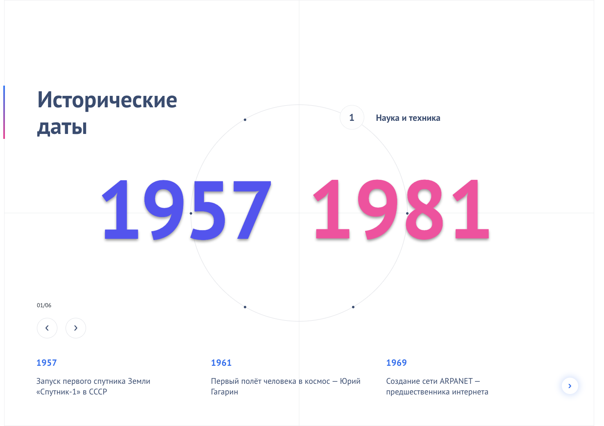
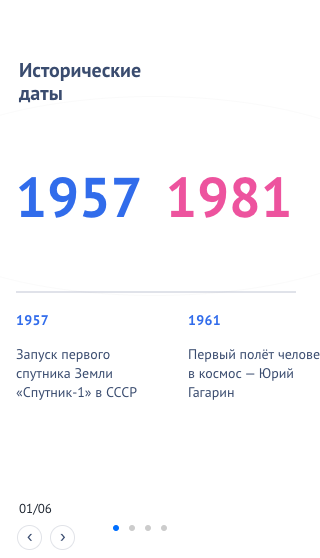

# Историческая лента (History Timeline)

Интерактивная лента времени с круговой навигацией, выбором сегментов и списком событий. Поддерживает адаптивную мобильную версию с пагинацией точками.

## Технологии

- React 18 + TypeScript
- SCSS (модульные стили по блокам)
- Swiper 11 (слайдер событий)
- Webpack 5 (dev server и сборка)

## Запуск проекта

1. Установите зависимости:

```bash
npm install
```

2. Запустите dev-сервер (откроется в браузере):

```bash
npm run dev
```

или

```bash
npm start
```

3. Сборка production:

```bash
npm run build
```

## Скрипты

- `npm run dev` — запуск dev-сервера с автообновлением
- `npm start` — альтернативный запуск dev-сервера
- `npm run build` — сборка проекта в production


### Desktop

<div align="center">
  
</div>


### Mobile
  
<div align="center">
  
</div> 
